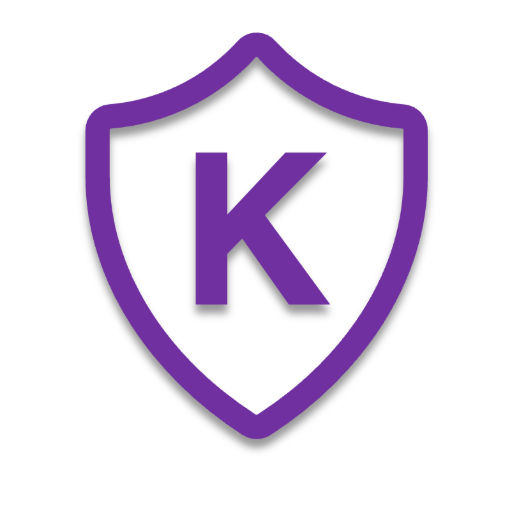

# KOKOROE



LLMに対して自動で脆弱性診断を行い、その結果から防御改善用の学習データを自動生成するツールです。

[]()

## Installation

環境による差分を最小限にするため、Docker Composeを使って開発しています。

```
# リポジトリのクローン
git clone git@github.com:retrieva/kokoroe.git
cd kokoroe

# コンテナイメージのビルド
docker compose build

# 初期セットアップの実行
docker compose run --rm rails-app bin/setup --skip-server
```

### LLM サーバーへの接続設定
本アプリケーションでは、 **脆弱性診断・学習データ作成を行うLLM（Evaluator）** と、 **検証対象となるLLM（Target）** の2種類のLLMを使用します。
それぞれ以下のようにして設定を行います。

#### 1. configファイルの作成

vLLMを使用したサーバーに対するconfigファイルの例は `config/auto-red-team-prompt/sample-production.json` や `config/auto-red-team-prompt/sample-evaluator.json` を参照してください。

#### 2. 環境変数の設定

環境変数は `.env.example` を参考にして `.env` ファイルを作成してください。
その際に、各LLMサーバーの設定を環境変数に記載する必要があります。

```
EVALUATOR_LLM_NAME=your_evaluator_model_name
EVALUATOR_LLM_PATH=./config/auto-red-team-prompt/sample-evaluator.json
TARGET_LLM=your_target_model_name
TARGET_LLM_PATH_PRODUCTION=./config/auto-red-team-prompt/sample-production.json
TARGET_LLM_PATH_DEVELOPMENT=./config/auto-red-team-prompt/sample-development.json
```

### 開発環境の起動

```
# 開発用サーバーの立ち上げ
docker compose up

# ブラウザで http://localhost:3000 にアクセス
```

### [Option] LLM サーバーの起動
本リポジトリでは、vLLMを使用したLLMサーバーの起動について、Pythonディレクトリ`auto-red-team-prompt`内にサンプルコードを用意しています。
詳細はそちらをご確認ください。

## 注意事項

- 本アプリケーションは LLM に対して、LLM を用いて脆弱性診断などを行います。上記に記載の手順で LLM サーバーの起動を実施、もしくは、LLM サーバーを別途用意していただく必要があります。

## 使用技術
- Ruby on Rails 8
- Python 3
  - `auto-red-team-prompt`
- Docker

## Contributing
Pull requestやIssueは大歓迎です！バグの報告や機能の提案など、どんなことでもお気軽にお知らせください。
詳細は `CONTRIBUTING.md` をご覧ください。


## License
Apache License 2.0
